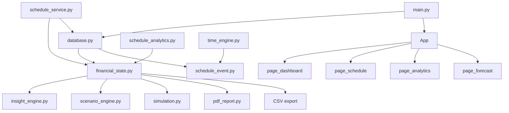

# FRE — System Architecture and Design Explanation

This document covers: the component diagram (convertible to a visual tool), data flow, and the reasoning behind every major design decision.

---

## 1. Component Diagram (for Mermaid / draw.io conversion)

```
┌──────────────────────────────────────────────────────────────────────────────┐
│                           FINANCIAL REALITY ENGINE                           │
│                                                                              │
│  ┌─────────────┐   ┌──────────────────┐   ┌──────────────────────────────┐  │
│  │  main.py    │   │   config.py       │   │         utils.py             │  │
│  │  Entry Point│   │   All constants   │   │   canon_name()               │  │
│  └──────┬──────┘   └──────────────────┘   │   normalize_job_name()       │  │
│         │                                  └──────────────────────────────┘  │
│         │  init_db() · dedup() · App()                                       │
│         ▼                                                                    │
│  ┌─────────────────────────────────────────────────────────────────────┐    │
│  │                          PERSISTENCE LAYER                          │    │
│  │                         database.py (531L)                          │    │
│  │                                                                     │    │
│  │  jobs │ expenses │ settings │ history │ events                      │    │
│  │  init_db() · migration · dedup_jobs/expenses()                      │    │
│  │  get_events() · get_events_for_week() · add_event()                 │    │
│  │  update_events_rate() · record_snapshot() · backup_database()       │    │
│  └──────────────────────────────┬──────────────────────────────────────┘    │
│                                 │                                            │
│            ┌────────────────────┼──────────────────────┐                   │
│            ▼                    ▼                       ▼                   │
│  ┌──────────────────┐  ┌──────────────────┐  ┌──────────────────────────┐  │
│  │  model.py         │  │ schedule_event.py│  │  DATA MODELS              │  │
│  │  Job              │  │ ScheduleEvent    │  │  FREQ_TO_WEEKLY           │  │
│  │  Expense          │  │ to_minutes()     │  │  CATEGORIES               │  │
│  │  FREQ_TO_WEEKLY   │  │ fmt_time()       │  │  CATEGORY_COLORS          │  │
│  └──────────────────┘  └──────────────────┘  └──────────────────────────┘  │
│                                                                              │
│  ─────────────────────── BUSINESS LOGIC LAYER ───────────────────────────   │
│                                                                              │
│  ┌────────────────────────────────────────────────────────────────────────┐ │
│  │                    financial_state.py (274L)                            │ │
│  │  SINGLE SOURCE OF TRUTH — no other module recalculates these           │ │
│  │                                                                         │ │
│  │  total_income_per_week()  total_expense_per_week()  net_weekly_flow()  │ │
│  │  savings_rate()           expense_by_category()     project_balance()  │ │
│  │  financial_health_score() risk_score()              weeks_to_goal()    │ │
│  │  add_job() / delete_job() [validated mutations → (bool, str)]          │ │
│  └────────────────────────────────────────────────────────────────────────┘ │
│                                                                              │
│  ┌───────────────────────┐   ┌──────────────────────────────────────────┐   │
│  │  schedule_service.py  │   │  insight_engine.py · scenario_engine.py  │   │
│  │  sync_schedule_to_jobs│   │  simulation.py                           │   │
│  │  (no GUI dependency)  │   │  What-If + Monte Carlo (500 runs)        │   │
│  └───────────────────────┘   └──────────────────────────────────────────┘   │
│                                                                              │
│  ─────────────────────── ANALYTICS LAYER ────────────────────────────────   │
│                                                                              │
│  ┌──────────────────────────────────────┐  ┌────────────────────────────┐  │
│  │  schedule_analytics.py (385L)         │  │  time_engine.py (205L)     │  │
│  │  PURE FUNCTIONS — no DB, no GUI       │  │  PURE FUNCTIONS            │  │
│  │                                       │  │                            │  │
│  │  income_by_job()                      │  │  get_free_blocks()         │  │
│  │  daily_totals()                       │  │  detect_conflicts()        │  │
│  │  date_range_summary()                 │  │  weekly_availability()     │  │
│  │  shift_impact() → ShiftImpact         │  │  opportunity_cost()        │  │
│  │  job_efficiency_report() → [JobEff.]  │  │  weekly_income_summary()   │  │
│  └──────────────────────────────────────┘  └────────────────────────────┘  │
│                                                                              │
│  ─────────────────────── PRESENTATION LAYER ────────────────────────────    │
│                                                                              │
│  ┌──────────────────────────────────────────────────────────────────────┐   │
│  │  app.py — DI Container + Navigation                                   │   │
│  │  App(tk.Tk) owns: FinancialState · ScenarioEngine · InsightEngine    │   │
│  │  Lazy page loading · Dark/light theme toggle · CSV/PDF export        │   │
│  └───────┬──────────────────────────────────────────────────────────────┘   │
│          │                                                                   │
│  ┌───────▼──────────────────────────────────────────────────────────────┐   │
│  │  theme.py · widgets.py · charts.py                                    │   │
│  │  UI primitives — palettes, ScrollFrame, TabBar, matplotlib embeds    │   │
│  └───────┬──────────────────────────────────────────────────────────────┘   │
│          │                                                                   │
│  ┌───────▼──────────────────────────────────────────────────────────────┐   │
│  │  Pages (7 files)                                                      │   │
│  │  page_dashboard · page_schedule · page_analytics · page_forecast     │   │
│  │  page_goals · page_data · page_settings                               │   │
│  └──────────────────────────────────────────────────────────────────────┘   │
│                                                                              │
│  ─────────────────────── OUTPUT LAYER ──────────────────────────────────    │
│                                                                              │
│  ┌──────────────────────────────┐  ┌──────────────────────────────────────┐ │
│  │  pdf_report.py (273L)         │  │  CSV export (in app.py)              │ │
│  │  reportlab · 7 sections       │  │  schedule_analytics enrichment       │ │
│  │  includes schedule summary    │  │  per-job breakdown + top earn days   │ │
│  └──────────────────────────────┘  └──────────────────────────────────────┘ │
└──────────────────────────────────────────────────────────────────────────────┘
```

### Mermaid Conversion Guide

To convert to a Mermaid flowchart for GitHub rendering:



---

## 2. Data Flow Maps

### 2.1 — Shift Entry to Financial Impact

```
User types shift in Add Event form
        │
        ▼
normalize_job_name(title, existing_names)          [utils.py]
  → exact match → canon-key match → fuzzy (≥0.82) → new canon form
        │
        ▼
ScheduleEvent.validate()                            [schedule_event.py]
  → title not blank, category valid, end > start, rate ≥ 0
        │
        ▼
time_engine.detect_conflicts(new_event, same_day_events)
  → interval intersection: ns < ee AND ne > es
  → if conflicts found: warn user, block save
        │
        ▼
database.add_event(event)                           [database.py]
  → INSERT INTO events (... shift_date)
  → returns new_id
        │
        ▼
schedule_service.sync_schedule_to_jobs(state)       [schedule_service.py]
  → group Work events by canon_name
  → sum hours per group
  → propagate known rates to unrated events
  → weekly_amount = total_hours × rate
  → upsert into state.jobs and DB
        │
        ▼
financial_state auto-reflects updated jobs
  → total_income_per_week() changes
  → risk_score() changes
  → project_balance(52) changes
        │
        ▼
Dashboard re-renders on next page load
PDF / CSV exports reflect new schedule data
```

### 2.2 — Analytics Request Path

```
User opens Analytics → Income tab
        │
        ▼
page_analytics._income()
        │
        ▼
db.get_events()                                     [database.py]
  → all ScheduleEvent rows from SQLite
        │
        ▼
schedule_analytics.income_by_job(events)            [schedule_analytics.py]
  → filter category == 'Work'
  → group by _canon(title)
  → IncomeGroup: total_hours, total_income, avg_rate, shift list
  → sorted by total_income desc
        │
        ▼
schedule_analytics.job_efficiency_report(events)
  → rank by income_per_hour
  → flag early_starts < 08:00, late_ends ≥ 22:00
  → JobEfficiency dataclass per job
        │
        ▼
page_analytics renders:
  → per-job table: hours / avg rate / shifts / total
  → efficiency ranking table with friction flags
```

### 2.3 — Monte Carlo Execution

```
User sets weeks horizon → page_forecast calls simulation.run_monte_carlo(state, weeks)
        │
        ▼
for i in range(500):
    balance = state.current_balance()
    for w in range(weeks):
        random_events = _roll_random_events()      # 10 event types, independent probabilities
        balance += state.net_weekly_flow() + random_events
    ending_balances.append(balance)
        │
        ▼
sort(ending_balances)
compute: average, best_case, worst_case, median, p25, p75
deficit_probability = count(b < 0) / 500 * 100
        │
        ▼
Return dict → page_forecast renders statistics
             → charts.monte_carlo_histogram(ending_balances) renders distribution
             → insight_engine.generate_insights(state, results) adds risk sentence
```

---

## 3. System Design Explanation

### 3.1 Why Income Is Derived, Not Stored

Most financial apps store income as a number in the database. FRE derives it from the schedule.

A `Job` record in the database carries `amount` and `frequency` — the face-value amount and how often it is paid. `weekly_income()` converts this using `FREQ_TO_WEEKLY`. But the `amount` itself is populated by `sync_schedule_to_jobs()`, which sums `total_hours × rate` from all matching Work events.

This means:
- Entering a shift automatically updates projected weekly income
- Removing a shift automatically reduces it
- The financial state always reflects the actual schedule, not a manually entered number

The alternative — requiring the user to enter income manually and separately maintain a schedule — creates two sources of truth that will inevitably disagree. FRE eliminates that class of inconsistency.

### 3.2 Single Source of Truth for Calculations

`financial_state.py` is the only place financial math is computed. `insight_engine.py`, `scenario_engine.py`, `simulation.py`, `page_analytics.py`, `pdf_report.py`, and the CSV exporter all read from it or accept it as a parameter — none reimplement its logic.

This was an explicit design decision enforced by making financial_state's methods the only path to financial numbers. If a page needs the savings rate, it calls `state.savings_rate()`. It does not compute `net_flow / income` inline. The consequence: there is no possible state where the dashboard shows a different savings rate than the PDF export.

### 3.3 Pure Functions for Analytics

`schedule_analytics.py` and `time_engine.py` are stateless modules. Their functions take data in, return data out, and touch nothing else. No global state, no database calls, no GUI calls, no `self` references.

This was motivated by testability: to test `income_by_job()`, you create a list of mock `ScheduleEvent` objects and call the function. No database fixture, no window, no app instance. The same function is called from `page_analytics.py`, `pdf_report.py`, and the CSV exporter with identical results.

Pure functions also make the analytics pipeline composable. `date_range_summary()` builds on `income_by_job()` and `daily_totals()`. `job_efficiency_report()` builds on `income_by_job()`. The layers stack cleanly because there are no side effects to manage.

### 3.4 Dependency Injection Through App

`App(tk.Tk)` owns three objects: `FinancialState`, `ScenarioEngine`, `InsightEngine`. Every page receives `App` as its second constructor argument and accesses state through `self.app.state`, engines through `self.app.scenario_engine`, etc.

No globals. No module-level singleton. No import of `financial_state` from inside a page file. The consequence: replacing `FinancialState` with a different implementation (e.g., one backed by PostgreSQL instead of SQLite) requires changing one line in `app.py`, not hunting through seven page files.

### 3.5 Validated Mutations with Explicit Return Contracts

Every method that changes data returns `(bool, str)`:

```python
def add_job(self, job: Job) -> tuple[bool, str]:
    ok, reason = self._validate_job(job)
    if not ok:
        return False, reason
    # ... proceed
    return True, f"'{job.name}' added."
```

The UI always knows what happened and has an exact message to display. There are no silent failures and no exceptions that reach the UI layer from a data mutation. This pattern is consistent across `add_job`, `delete_job`, `add_expense`, `delete_expense`, `set_balance`, and `ScheduleEvent.validate()`.

### 3.6 Schema Migration as a First-Class Concern

`init_db()` inspects the live schema using `PRAGMA table_info()` before deciding what to create or alter. The old schema used `hourly_rate` and `hours_per_week` columns. The migration:

```sql
ALTER TABLE jobs ADD COLUMN amount    REAL
ALTER TABLE jobs ADD COLUMN frequency TEXT DEFAULT 'Weekly'
UPDATE jobs SET amount = hourly_rate * hours_per_week, frequency = 'Weekly'
-- rebuild clean table, copy data, drop old, rename new
```

This runs automatically on first launch. Users who had data in the old format lose nothing. New installs see only the current schema.

The `events` table similarly detects a missing `shift_date` column and adds it with a safe default (`''`), making all existing events legacy-compatible with the date-aware query functions.

### 3.7 Name Canonicalization as a Data Integrity Layer

Variable-income workers enter the same job under multiple spellings across sessions. `"Admissions"`, `"admissions"`, `"Admission"`, and `"admissions office"` are all the same job — but a naive string comparison treats them as four distinct records.

FRE addresses this at three points in the pipeline:

| Stage | Function | Behaviour |
|---|---|---|
| Input | `normalize_job_name()` | Resolves typed name to stored canonical via 4-step lookup |
| Storage | `dedup_jobs()` on startup | Fuzzy-clusters existing rows, merges to highest-amount canonical |
| Analytics | `_canon()` wrapper | Groups income by canonical key so variant spellings aggregate correctly |

All three call the same `canon_name()` function from `utils.py`. Before this was centralised, four independent implementations existed — any one drifting would cause silent grouping failures.

### 3.8 The shift_date Design Decision

`ScheduleEvent` carries two time-related fields: `day` (weekday name: `"Monday"`) and `shift_date` (ISO date: `"2025-02-10"`).

`day` was the original field, used for display grouping within the week view. `shift_date` was added when the analytics layer required actual calendar dates to compute `daily_totals()`, `weekly_breakdown()`, and `top_earning_days()`.

Separating them allows:
- Backward compatibility: legacy events with no `shift_date` are not broken; they are simply excluded from date-based analytics queries
- Week navigation: `page_schedule.py` navigates by incrementing `week_start` by 7 days, then queries `get_events_for_week(week_start)` which filters by `shift_date >= start AND shift_date <= end`
- Month queries: `get_events_for_month(year, month)` delegates to `get_events_for_date_range()` using the correct month boundaries

### 3.9 Why 500 Monte Carlo Runs

500 is the convergence point for the probability distribution used here. At 100 runs, `deficit_probability` has high variance between runs of the same simulation. At 500, the standard error on a 15% probability is approximately ±1.7 percentage points — sufficient precision for the decision-support use case. At 1,000, runtime doubles for marginal accuracy gain. The constant lives in `config.MONTE_CARLO_RUNS` and can be adjusted.

### 3.10 The Frequency Normalisation Contract

Every income and expense amount in the system is normalised to a weekly equivalent before any calculation. The contract is defined in `model.py`:

```python
FREQ_TO_WEEKLY = {
    "Daily":    7.0,
    "Weekly":   1.0,
    "Biweekly": 0.5,
    "Monthly":  12 / 52,   # ≈ 0.2308
}
```

`job.weekly_income()` and `expense.weekly_amount()` both use this table. Nothing else in the codebase does frequency arithmetic — it happens once, in these two methods, using one table. A monthly rent of $1,200 and a daily coffee expense of $5 are both correctly represented in the same weekly unit for net flow and projection calculations.

---

## 4. Layer Interaction Summary

```
┌────────────────┐     reads       ┌────────────────────────┐
│  UI Pages      │ ──────────────► │  financial_state.py    │
│  pdf_report.py │                 │  (never recalculates)  │
│  CSV export    │                 └────────────────────────┘
└────────────────┘                           ▲
                                             │ sync
                              ┌──────────────┴─────────────┐
                              │  schedule_service.py        │
                              │  reads Work events from DB  │
                              │  writes Job amounts to DB   │
                              └──────────────┬─────────────┘
                                             │ queries
                              ┌──────────────▼─────────────┐
                              │  database.py / events table │
                              └──────────────┬─────────────┘
                                             │ raw events
                              ┌──────────────▼─────────────┐
                              │  schedule_analytics.py      │
                              │  time_engine.py             │
                              │  (pure function pipelines)  │
                              └─────────────────────────────┘
```

The analytics layer never writes to the database. The database layer never imports from the UI. The financial state never imports from the UI. These boundaries are what make the test suite possible without a window and the exports possible without opening the app.
