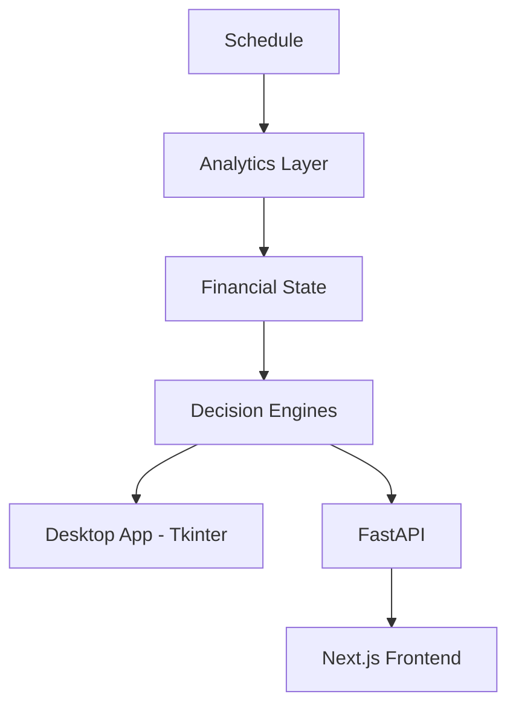

# ShiftIQ

**A decision-intelligence system for variable-income workers.**

[](https://github.com/gharteykeziah/ShiftIQ/actions/workflows/tests.yml)
[](LICENSE)
[](pyproject.toml)
[](frontend/package.json)

ShiftIQ applies optimization algorithms and probabilistic simulation to financial planning for variable-income workers. It models income as a function of scheduled work rather than a fixed salary, helping hourly employees, gig workers, and students make sharper financial decisions. The project combines dynamic programming, Monte Carlo simulation, and full-stack engineering (Python/FastAPI + Next.js) into a system that is deployed, authenticated, and tested end to end.

[Live Demo](https://shift-iq-beta.vercel.app) · [Documentation](docs/) · [API Reference](docs/API.md)

## Highlights

- Dynamic programming (0/1 knapsack) shift optimizer: exact, not greedy
- Monte Carlo engine simulating 500+ possible financial futures per run
- 5× faster simulations via NumPy vectorization (measured, see [`docs/Performance.md`](docs/Performance.md))
- JWT authentication with per-user data isolation and rate limiting
- 350+ automated tests across the engine and API (pytest + FastAPI `TestClient`)
- Full-stack architecture: Python/FastAPI backend, Next.js frontend, Tkinter desktop client

## Key Engineering Challenges

ShiftIQ was built to work through several problems beyond CRUD:

- Modeling variable income as a derived quantity instead of a fixed, manually entered number
- Formulating shift selection as a constrained optimization problem (0/1 knapsack)
- Forecasting financial uncertainty with Monte Carlo simulation instead of a single projection
- Sharing one business-logic engine across a desktop client and a web client with zero duplication
- Maintaining a single source of truth for every derived financial number, enforced architecturally

---

## Table of Contents

- [Why ShiftIQ Exists](#why-shiftiq-exists)
- [What It Does](#what-it-does)
- [Features](#features)
- [Project Structure](#project-structure)
- [Architecture](#architecture)
- [Tech Stack](#tech-stack)
- [Demo](#demo)
- [Installation](#installation)
- [Local Development](#local-development)
- [Environment Variables](#environment-variables)
- [Backend Overview](#backend-overview)
- [Frontend Overview](#frontend-overview)
- [Algorithms](#algorithms)
- [Testing](#testing)
- [Roadmap](#roadmap)
- [Contributing](#contributing)
- [Learn More](#learn-more)
- [License](#license)

---

## Why ShiftIQ Exists

Most budgeting software assumes income is a fixed number that arrives on a fixed date. That assumption breaks for anyone paid by the hour, the gig, or the shift: a paycheck that varies by $200 week to week isn't a rounding error; it's the entire planning problem.

ShiftIQ was built on the opposite assumption: income is a *function of the schedule*, not a static input. Entering a shift updates projected income automatically; removing one reduces it. There's no separate "enter your income" step to fall out of sync with reality.

## What It Does

ShiftIQ answers questions traditional budgeting apps can't:

- Which combination of available shifts maximizes my weekly income?
- How will dropping (or adding) a shift affect my savings rate?
- At my current pace, how long until I hit a specific financial goal?
- How risky is my financial situation, and what's driving that risk?

## Features

- **Schedule & free time:** finds every open block in the week and ranks it by earning potential
- **Income tracking:** daily/weekly/biweekly/monthly pay normalized to one weekly figure
- **Financial health:** net weekly flow, savings rate, and a 0–100 risk score, recalculated on every change
- **Projections & scenarios:** balance forecasts at 4/8/12/26/52 weeks, plus side-by-side what-ifs
- **Shift optimizer:** exact 0/1 knapsack solver for the highest-value shift combination under an hour budget
- **Monte Carlo simulation:** 500 vectorized trajectories modeling income and expense variability
- **Multi-user API:** JWT auth, per-user data isolation, rate limiting, SQLite or PostgreSQL

## Project Structure

The Python engine currently lives as flat modules at the repository root rather than in nested packages, a deliberate, if unusual, layout carried over from the project's original single-app structure:

```
ShiftIQ/
│
├── api.py, app.py, main.py        # transport layers: FastAPI, Tkinter shell, entry point
├── financial_state.py             # single source of truth for all derived numbers
├── optimizer.py, simulation.py    # decision engines (knapsack, Monte Carlo, what-if)
├── shift_analytics.py,            # pure-function analytics layer
│   time_engine.py
├── database.py, db_connection.py, # persistence (SQLite / PostgreSQL)
│   db_pg.py
├── model.py, schedule_event.py    # data models
├── page_*.py                      # desktop UI pages (Tkinter)
│
├── frontend/                      # Next.js 14 web app
│   ├── src/app/                   # routes (App Router)
│   ├── src/components/            # UI components
│   ├── src/features/              # feature-scoped modules
│   └── src/lib/                   # API client, types, utilities
│
├── docs/                          # architecture, algorithms, API reference
├── archive/                       # superseded code, kept for reference
├── scripts/                       # demo, benchmarks, migration utilities
├── test_shiftiq.py, test_api.py   # test suites
└── .github/workflows/             # CI
```

> A `backend/` package split (grouping the engine into `api/`, `services/`, `simulation/`, etc.) is a reasonable next refactor, but it's a real restructuring: it touches every import, the Dockerfile, and CI. It's tracked as a deliberate decision rather than done incidentally. See [Roadmap](#roadmap).

## Architecture



Both frontends (E and G, via F) are zero-logic transport layers over the same engine: every number either one displays comes from the same Python modules. Full component diagrams, data-flow maps, and the reasoning behind each design decision: [`docs/Architecture.md`](docs/Architecture.md) and [`docs/Engineering-Decisions.md`](docs/Engineering-Decisions.md).

## Tech Stack

**Languages**
Python · TypeScript

**Backend**
FastAPI · Pydantic v2 · SQLAlchemy · Tkinter (desktop UI)

**Frontend**
Next.js 14 · React 18 · Tailwind CSS · Recharts

**Data & Numerics**
SQLite / PostgreSQL · NumPy · Matplotlib · ReportLab

**Auth & Security**
JWT (`python-jose`) · `bcrypt` · `slowapi` rate limiting

**Infrastructure**
Docker · GitHub Actions · Render / Railway / Heroku / AWS App Runner

**Testing**
pytest · FastAPI `TestClient`

## Demo

The web app is live at **[shift-iq-beta.vercel.app](https://shift-iq-beta.vercel.app)**.

To run things locally instead:

```bash
python3 scripts/demo.py                     # end-to-end demo, no GUI required
python3 scripts/benchmark_monte_carlo.py    # vectorization benchmark
```

With the API running, interactive docs are at `http://127.0.0.1:8000/docs`.

## Installation

```bash
git clone https://github.com/gharteykeziah/ShiftIQ.git
cd ShiftIQ
pip install -r requirements.txt
python3 main.py
```

> **macOS:** if the window is blank on first launch, run `brew install python-tk`.

## Local Development

```bash
# Backend / desktop app
pip install -r requirements.txt
python3 main.py

# API service
pip install -r requirements-api.txt
uvicorn api:app --reload            # http://127.0.0.1:8000

# Frontend
cd frontend && npm install
cp .env.local.example .env.local
npm run dev                          # http://localhost:3000

# Tests
python3 -m pytest test_shiftiq.py test_api.py -v
```

Full setup, code style, and commit conventions: [`CONTRIBUTING.md`](CONTRIBUTING.md).

## Environment Variables

| Variable | Where | Required | Description |
|---|---|---|---|
| `DATABASE_URL` | backend `.env` | No | PostgreSQL connection string; blank uses local SQLite |
| `PORT` | backend `.env` | No | FastAPI port (default `8000`) |
| `SECRET_KEY` | backend `.env` | Yes (API) | JWT signing key |
| `CORS_ORIGINS` | backend `.env` | Yes (prod) | Allowed frontend origins; wildcard rejected at startup |
| `NEXT_PUBLIC_API_URL` | `frontend/.env.local` | Yes | Base URL of the API the frontend calls |

See [`.env.example`](.env.example) and [`frontend/.env.local.example`](frontend/.env.local.example).

## Backend Overview

Four layers, each with one responsibility:

```
Persistence  →  State  →  Analytics & Decision Engines  →  Transport (desktop app / API)
```

- **Persistence** (`database.py`, `db_connection.py`, `db_pg.py`): SQLite by default, PostgreSQL in production, one connection layer
- **State** (`financial_state.py`): the only place financial math is computed; nothing else recomputes it
- **Analytics & engines:** pure functions and decision engines (`shift_analytics.py`, `simulation.py`, `optimizer.py`, `scenario_engine.py`) with no DB or UI dependency
- **Transport** (`app.py`, `api.py`): zero-logic layers that call the engine and render or serialize the result

Full endpoint reference: [`docs/API.md`](docs/API.md) (or `/docs` on a running server).

## Frontend Overview

Next.js 14 App Router project in `frontend/`:

- **Routes:** `dashboard`, `jobs`, `expenses`, `shifts`, `goals`, `simulation`, plus `login`/`register`/`onboarding`
- **Design system:** centralized tokens for color, spacing, radius, shadows, typography
- **Components:** organized by concern (`ui/`, `layout/`, `dashboard/`, `marketing/`)
- **API client** (`src/lib/api.ts`): the only place the frontend talks to the backend

The frontend holds no business logic. It renders whatever the API returns.

## Algorithms

### Dynamic Programming

**Purpose:** maximize weekly earnings under an hour budget.
**Why not greedy:** taking the highest-rate shifts first is provably suboptimal once a budget constrains which shifts can coexist.
**Complexity:** O(n × capacity), capacity discretized to quarter-hour units.

```python
optimize_shift_selection(candidates, max_hours=10)
# greedy picks the $20/hr shift alone:      $180
# knapsack picks two lower-rate shifts:     $190  <- provably optimal
```

---

### Monte Carlo Simulation

**Purpose:** forecast financial uncertainty instead of a single projection.
**Technique:** 500 trajectories sampling 10 stochastic weekly event types, vectorized with NumPy instead of nested Python loops.
**Result:** a distribution over outcomes (best/worst case, percentiles, deficit probability), not a single guess.

---

### Canonicalization Engine

**Purpose:** normalize inconsistent job names (`"Admissions"`, `"admissions office"`) into one record.
**Technique:** exact match, then canonical-key match, then fuzzy match (`difflib`, ≥0.82 similarity), then new canonical form.

---

Full write-ups: [`docs/Algorithms.md`](docs/Algorithms.md) · Benchmark methodology: [`docs/Performance.md`](docs/Performance.md)

## Testing

No GUI instantiation, no live database dependency:

```bash
python3 -m pytest test_shiftiq.py -v   # engine & business-logic tests
python3 -m pytest test_api.py -v        # API tests: auth, XSS, data isolation
```

CI runs both suites on every push/PR across Python 3.10–3.12, plus an API import smoke test.

## Roadmap

**Completed**
- Dynamic programming shift optimizer
- Monte Carlo simulation engine
- JWT authentication and multi-user data isolation
- FastAPI backend with PostgreSQL support

**In Progress**
- Next.js dashboard (feature parity with the desktop app)
- Bulk schedule import (CSV / pasted text)

**Planned**
- Mobile-responsive layout for the web app
- Additional deployment guides (Railway, Fly.io)

This reflects the current direction of the codebase, not a committed release schedule.

## Contributing

Contributions are welcome. See [`CONTRIBUTING.md`](CONTRIBUTING.md) for setup, tests, and commit conventions.

## Learn More

| Doc | Covers |
|---|---|
| [`docs/Architecture.md`](docs/Architecture.md) | Component diagram, data-flow maps |
| [`docs/Engineering-Decisions.md`](docs/Engineering-Decisions.md) | Why the system is built the way it is |
| [`docs/Algorithms.md`](docs/Algorithms.md) | Optimizer, Monte Carlo, canonicalization in depth |
| [`docs/Performance.md`](docs/Performance.md) | Vectorization benchmarks |
| [`docs/API.md`](docs/API.md) | Full endpoint reference |

## License

MIT. See [`LICENSE`](LICENSE).
