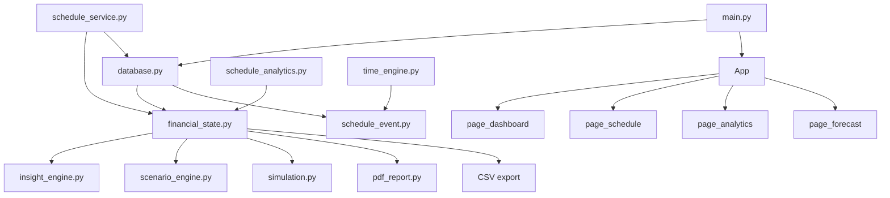

# Architecture

Component diagram and data-flow maps for ShiftIQ. For the reasoning behind these choices, see [`Engineering-Decisions.md`](Engineering-Decisions.md).

---

## 1. Component Diagram

```
┌──────────────────────────────────────────────────────────────────────────────┐
│                                    SHIFTIQ                                   │
│                                                                              │
│  ┌─────────────┐   ┌──────────────────┐   ┌──────────────────────────────┐  │
│  │  main.py    │   │   config.py       │   │         utils.py             │  │
│  │  Entry Point│   │   All constants   │   │   canon_name()               │  │
│  └──────┬──────┘   └──────────────────┘   │   normalize_job_name()       │  │
│         │                                  └──────────────────────────────┘  │
│         │  init_db() · dedup() · App()                                       │
│         ▼                                                                    │
│  ┌─────────────────────────────────────────────────────────────────────┐    │
│  │                          PERSISTENCE LAYER                          │    │
│  │                         database.py (531L)                          │    │
│  │                                                                     │    │
│  │  jobs │ expenses │ settings │ history │ events                      │    │
│  │  init_db() · migration · dedup_jobs/expenses()                      │    │
│  │  get_events() · get_events_for_week() · add_event()                 │    │
│  │  update_events_rate() · record_snapshot() · backup_database()       │    │
│  └──────────────────────────────┬──────────────────────────────────────┘    │
│                                 │                                            │
│            ┌────────────────────┼──────────────────────┐                   │
│            ▼                    ▼                       ▼                   │
│  ┌──────────────────┐  ┌──────────────────┐  ┌──────────────────────────┐  │
│  │  model.py         │  │ schedule_event.py│  │  DATA MODELS              │  │
│  │  Job              │  │ ScheduleEvent    │  │  FREQ_TO_WEEKLY           │  │
│  │  Expense          │  │ to_minutes()     │  │  CATEGORIES               │  │
│  │  FREQ_TO_WEEKLY   │  │ fmt_time()       │  │  CATEGORY_COLORS          │  │
│  └──────────────────┘  └──────────────────┘  └──────────────────────────┘  │
│                                                                              │
│  ─────────────────────── BUSINESS LOGIC LAYER ───────────────────────────   │
│                                                                              │
│  ┌────────────────────────────────────────────────────────────────────────┐ │
│  │                    financial_state.py (274L)                            │ │
│  │  SINGLE SOURCE OF TRUTH — no other module recalculates these           │ │
│  │                                                                         │ │
│  │  total_income_per_week()  total_expense_per_week()  net_weekly_flow()  │ │
│  │  savings_rate()           expense_by_category()     project_balance()  │ │
│  │  financial_health_score() risk_score()              weeks_to_goal()    │ │
│  │  add_job() / delete_job() [validated mutations → (bool, str)]          │ │
│  └────────────────────────────────────────────────────────────────────────┘ │
│                                                                              │
│  ┌───────────────────────┐   ┌──────────────────────────────────────────┐   │
│  │  schedule_service.py  │   │  insight_engine.py · scenario_engine.py  │   │
│  │  sync_schedule_to_jobs│   │  simulation.py                           │   │
│  │  (no GUI dependency)  │   │  What-If + Monte Carlo (500 runs)        │   │
│  └───────────────────────┘   └──────────────────────────────────────────┘   │
│                                                                              │
│  ─────────────────────── ANALYTICS LAYER ────────────────────────────────   │
│                                                                              │
│  ┌──────────────────────────────────────┐  ┌────────────────────────────┐  │
│  │  schedule_analytics.py (385L)         │  │  time_engine.py (205L)     │  │
│  │  PURE FUNCTIONS — no DB, no GUI       │  │  PURE FUNCTIONS            │  │
│  │                                       │  │                            │  │
│  │  income_by_job()                      │  │  get_free_blocks()         │  │
│  │  daily_totals()                       │  │  detect_conflicts()        │  │
│  │  date_range_summary()                 │  │  weekly_availability()     │  │
│  │  shift_impact() → ShiftImpact         │  │  opportunity_cost()        │  │
│  │  job_efficiency_report() → [JobEff.]  │  │  weekly_income_summary()   │  │
│  └──────────────────────────────────────┘  └────────────────────────────┘  │
│                                                                              │
│  ─────────────────────── PRESENTATION LAYER ────────────────────────────    │
│                                                                              │
│  ┌──────────────────────────────────────────────────────────────────────┐   │
│  │  app.py — DI Container + Navigation                                   │   │
│  │  App(tk.Tk) owns: FinancialState · ScenarioEngine · InsightEngine    │   │
│  │  Lazy page loading · Dark/light theme toggle · CSV/PDF export        │   │
│  └───────┬──────────────────────────────────────────────────────────────┘   │
│          │                                                                   │
│  ┌───────▼──────────────────────────────────────────────────────────────┐   │
│  │  theme.py · widgets.py · charts.py                                    │   │
│  │  UI primitives — palettes, ScrollFrame, TabBar, matplotlib embeds    │   │
│  └───────┬──────────────────────────────────────────────────────────────┘   │
│          │                                                                   │
│  ┌───────▼──────────────────────────────────────────────────────────────┐   │
│  │  Pages (7 files)                                                      │   │
│  │  page_dashboard · page_schedule · page_analytics · page_forecast     │   │
│  │  page_goals · page_data · page_settings                               │   │
│  └──────────────────────────────────────────────────────────────────────┘   │
│                                                                              │
│  ─────────────────────── OUTPUT LAYER ──────────────────────────────────    │
│                                                                              │
│  ┌──────────────────────────────┐  ┌──────────────────────────────────────┐ │
│  │  pdf_report.py (273L)         │  │  CSV export (in app.py)              │ │
│  │  reportlab · 7 sections       │  │  schedule_analytics enrichment       │ │
│  │  includes schedule summary    │  │  per-job breakdown + top earn days   │ │
│  └──────────────────────────────┘  └──────────────────────────────────────┘ │
└──────────────────────────────────────────────────────────────────────────────┘
```

### Mermaid Conversion



---

## 2. Data Flow Maps

### 2.1 — Shift Entry to Financial Impact

```
User types shift in Add Event form
        │
        ▼
normalize_job_name(title, existing_names)          [utils.py]
  → exact match → canon-key match → fuzzy (≥0.82) → new canon form
        │
        ▼
ScheduleEvent.validate()                            [schedule_event.py]
  → title not blank, category valid, end > start, rate ≥ 0
        │
        ▼
time_engine.detect_conflicts(new_event, same_day_events)
  → interval intersection: ns < ee AND ne > es
  → if conflicts found: warn user, block save
        │
        ▼
database.add_event(event)                           [database.py]
  → INSERT INTO events (... shift_date)
  → returns new_id
        │
        ▼
schedule_service.sync_schedule_to_jobs(state)       [schedule_service.py]
  → group Work events by canon_name
  → sum hours per group
  → propagate known rates to unrated events
  → weekly_amount = total_hours × rate
  → upsert into state.jobs and DB
        │
        ▼
financial_state auto-reflects updated jobs
  → total_income_per_week() changes
  → risk_score() changes
  → project_balance(52) changes
        │
        ▼
Dashboard re-renders on next page load
PDF / CSV exports reflect new schedule data
```

### 2.2 — Analytics Request Path

```
User opens Analytics → Income tab
        │
        ▼
page_analytics._income()
        │
        ▼
db.get_events()                                     [database.py]
  → all ScheduleEvent rows from SQLite
        │
        ▼
schedule_analytics.income_by_job(events)            [schedule_analytics.py]
  → filter category == 'Work'
  → group by _canon(title)
  → IncomeGroup: total_hours, total_income, avg_rate, shift list
  → sorted by total_income desc
        │
        ▼
schedule_analytics.job_efficiency_report(events)
  → rank by income_per_hour
  → flag early_starts < 08:00, late_ends ≥ 22:00
  → JobEfficiency dataclass per job
        │
        ▼
page_analytics renders:
  → per-job table: hours / avg rate / shifts / total
  → efficiency ranking table with friction flags
```

### 2.3 — Monte Carlo Execution

```
User sets weeks horizon → page_forecast calls simulation.run_monte_carlo(state, weeks)
        │
        ▼
for i in range(500):
    balance = state.current_balance()
    for w in range(weeks):
        random_events = _roll_random_events()      # 10 event types, independent probabilities
        balance += state.net_weekly_flow() + random_events
    ending_balances.append(balance)
        │
        ▼
sort(ending_balances)
compute: average, best_case, worst_case, median, p25, p75
deficit_probability = count(b < 0) / 500 * 100
        │
        ▼
Return dict → page_forecast renders statistics
             → charts.monte_carlo_histogram(ending_balances) renders distribution
             → insight_engine.generate_insights(state, results) adds risk sentence
```

---

## 3. Layer Interaction Summary

```
┌────────────────┐     reads       ┌────────────────────────┐
│  UI Pages      │ ──────────────► │  financial_state.py    │
│  pdf_report.py │                 │  (never recalculates)  │
│  CSV export    │                 └────────────────────────┘
└────────────────┘                           ▲
                                             │ sync
                              ┌──────────────┴─────────────┐
                              │  schedule_service.py        │
                              │  reads Work events from DB  │
                              │  writes Job amounts to DB   │
                              └──────────────┬─────────────┘
                                             │ queries
                              ┌──────────────▼─────────────┐
                              │  database.py / events table │
                              └──────────────┬─────────────┘
                                             │ raw events
                              ┌──────────────▼─────────────┐
                              │  schedule_analytics.py      │
                              │  time_engine.py             │
                              │  (pure function pipelines)  │
                              └─────────────────────────────┘
```

The analytics layer never writes to the database. The database layer never imports from the UI. The financial state never imports from the UI. These boundaries are what make the test suite possible without a window and the exports possible without opening the app.
